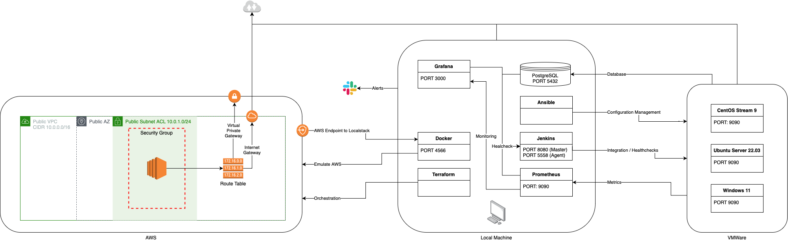

# Local Development

| Platform | Notes |
| :--- | :--- |
| AWS | Emulated AWS components are not at 100%  due to free features |
| Docker | Docker **macvlan** network currently has a major limitation in Mac environment, hence not used. Currently using Localstack as free. Features are limited. |
| Grafana | IaaC not yet implemented. |
| Jenkins | Pipeline scripts on-going |
| VMWare | No free IaaC solutions found yet |

# Features [(Screenshots)](Screenshots/)

| Platform | Features |
| :--- | ---: |
| CentOS Stream 9 | Ansible access Database access Jenkins agent compatible Node Exporter installed SFTP, SSH Ready |
| Grafana Alarm | One-time alarm if agent uptime reaches 1hr Slack Notification |
| Localstack | Cluster Reporting via AWS-CLI + Shell [Example](https://github.com/danericpelayo/development/blob/main/Localstack/cluster.json) Cluster Scale up/down automation via Docker-Compose + Terraform |
| Prometheus | AlertManager (**on-going**) Grafana Data Source  |
| Ubuntu Server 22.03.4 | Ansible access Database access Jenkins agent compatible Node Exporter installed SFTP, SSH Ready |
| Windows 11 (Activated :sunglasses:) | Ansible access + Chocolatey SFTP, SSH (Powershell) Ready WMI Exporter installed |

# Project Infrastructure

| Platform | Purpose | Components |
| :--- | :--- | ---: |
| AWS | Localstack Emulation | EC2 Internet Gateways Network ACL Route Tables Security Groups Subnet VPC |
| Local Machine | Containerization Database IaaC Integration Monitoring Orchestration  | Ansible Docker Grafana Jenkins PostgreSQL Prometheus Terraform |
| VMWare     | Jenkins Agents | CentOS Stream 9 Ubuntu Server 22.03 Windows 11 |

# References

Database [PostgreSQL](https://www.postgresql.org/download/)

Diagram [Draw.io](https://app.diagrams.net)

Emulate AWS [Localstack](https://localstack.cloud)

Open-source Dashboards [Grafana Dashboards](https://grafana.com/grafana/dashboards/)

Parse JSON [JSONGrid](https://jsongrid.com)

Virtual Machine Image [CentOS Stream](https://www.centos.org/centos-stream/)

Virtual Machine Image [Ubuntu Server ARM](https://ubuntu.com/download/server/arm)

Virtual Machine Image [Windows 11 Insider ARM](https://www.microsoft.com/en-us/software-download/windowsinsiderpreviewARM64)

Virtualization Software [VMWare Fusion 13](https://store-us.vmware.com/fusion_buy_dual?utm_source=google&utm_medium=cpc&utm_term=engine:google%7Ccampaignid:13610504072%7Cadid:544114080438%7Cgclid:CjwKCAjwpayjBhAnEiwA-7enawDMDcfT6SLLbUITKgGOce2uiqAd_0RSh4-wj26B4Je6-X6bw3JWWBoC4BsQAvD_BwE&gad=1&gclid=CjwKCAjwpayjBhAnEiwA-7enawDMDcfT6SLLbUITKgGOce2uiqAd_0RSh4-wj26B4Je6-X6bw3JWWBoC4BsQAvD_BwE)

## LICENSE

[MIT License](LICENSE)
